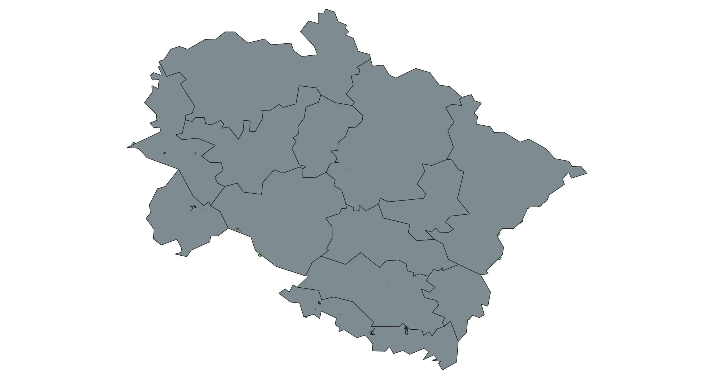

# Uttarkhand Spatial Data

### Source

Data on this repository has been scraped from:

- [GIS SIIDCUL](https://gis-siidcul.com/)

When loading the above site, a 6.5MB JSON file is downloaded by the browser. The JSON file contains all the data in this repository. The `split.sh` script is used to split the JSON into the feature-wise GeoJSON files in the `data/` folder.

### Data

Available for the following features:

- 11kv
- 33kv
- bridge
- compline
- elines
- misc
- parkbounds
- plot
- Police Stations
- roads
- uk_district1
- vegetation
